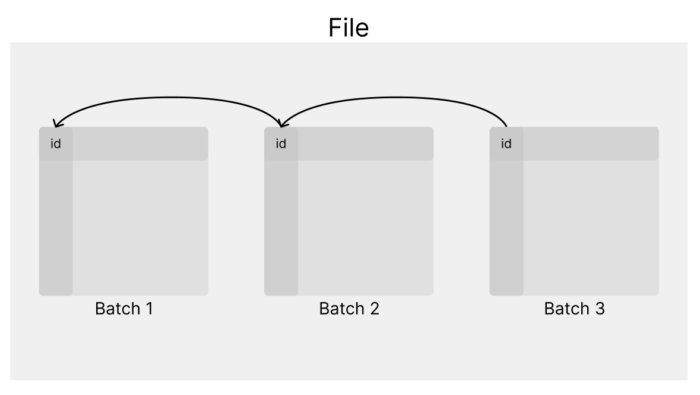

# Custom Analytical DBMS Project

An original project of an analytical Database Management System (DBMS), designed for high-performance processing of large datasets (Big Data). The system is based on a proprietary columnar format and data compression

## Running the Program

### Prerequisites
The project uses git submodules: `zstd` (compression), `cpp-restbed-server` (REST API), and `csv-parser`. To clone the repository along with its dependencies, run:

```bash
# This may take a few minutes
git submodule update --init --recursive

# Building the docker image
docker build -t isbd . 

# Running the application
`./run_docker.sh
```

Query results and errors are logged to persistent files: `queries.json`, `errors.json`, and `results.json`. These remain available even after an application restart. While the program is running, you can view information about existing tables in the `metadata.json` file.

### System Architecture
#### Storage Layer
Data is stored in a proprietary binary format that is column-oriented. This format minimizes I/O operations by allowing only the columns required by a query to be read

#### Data Compression
Dedicated algorithms have been applied for different data types:
1) Numerical Columns (INT64): A hybrid of Delta Encoding and Variable Length Int Encoding is used. A delta_base is subtracted from each value in the batch.
2) Text Columns (VARCHAR): Compression using the zstd library.


#### Batch Write Algorithm
The graphical representation of the write process is shown below:


Detailed procedure:
1. Write the batch_magic, the number of rows, and the number of numerical and text columns.
2. For each column, write an offset pointing to where the column with the same name begins in the previous batch, then write column metadata (column name length, compressed data size, etc.) and the compressed data.
3. Update the map with each column write; in the first batch, all offsets are set to 0.
4. When the file exceeds the PART_LIMIT size limit, save the current state of the map at the end of the file. Then, modify the map values by setting all offsets to 0 and close the file.

#### Efficient Column Read Algorithm
1) Open the file.
2) Go to the end of the file and read the encoded column map.
3) Read the offset corresponding to the column name.
4) Move to that offset and read the column data from the batch.
5) The column metadata contains its length, so the system knows how many bytes to read
7) Read the offset to the column with the same name from the previous batch (from the metadata).
6) Repeat steps 4-7 until the offset in the metadata is 0.


## Key Functionalities and Optimizations

### Common Subexpression Elimination (CSE)
Common Subexpression Elimination (CSE) - Tree Optimization: An advanced optimizer has been implemented to detect identical sub-operations within a query

    * **Expression Tree Hashing**: Every expression (e.g., function, operator) is represented as a tree. The system recursively calculates a unique hash for each node, depending on the operation type and the hashes of its children
    * **Commutativity Support:** For commutative operations (e.g., a + b and b + a), the children are sorted by their hash values before calculating the parent's hash, allowing the detection of identical operations regardless of the input order
    * **Result**: Common subtrees are calculated only once during the input projection phase and stored in a temporary column used by other operators.


#### External Merge Sort:
External Merge Sort: To enable sorting of data exceeding available RAM, a two-phase algorithm was implemented
1.  **Run Generation Phase:** The system reads portions of data to fill the memory buffer, sorts them (In-Memory Sort), and flushes them to disk as temporary sorted files (runs).
2.  **Merge Phase:** Utilizes a k-way merge mechanism. The system opens all temporary files simultaneously, and a priority queue (Heap) selects the smallest element among the leading elements of all series, producing the final result in a streaming fashion.


#### Validation and Planning:
Before a query is executed, the ***Planner*** performs semantic validation
1.  Verifies the existence of columns in the Metastore.
2.  Checks type compatibility (e.g., ensuring text is not divided by a number).
3.  Ensures that the expression in the WHERE clause returns a boolean type (BOOL).


#### Example Usage

Queries should comply with the grammar provided in the interface.yaml file. The example.txt file contains sample queries that can be executed
